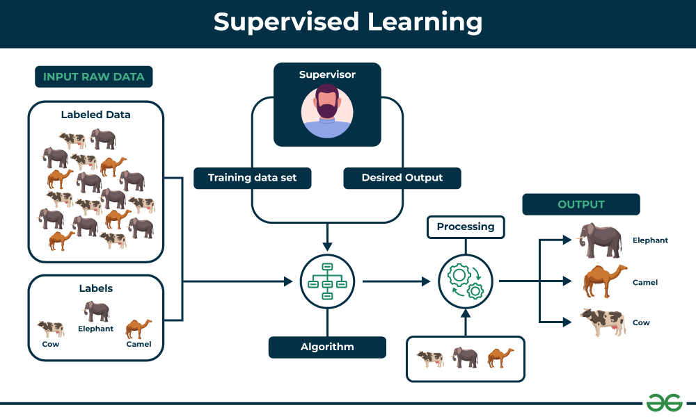

### Topic : UNIT 1(Introduction to Neural Networks And Deep Learning)

Hello and welcome to my blog! Before we dive into the heart of our discussion, let's take a moment to refresh our memories on what Artificial Intelligence (AI) truly means. AI, a term that emerged in the 1950s, signifies the simulation of human intelligence by machines.

### Understanding Machine Learning?
Machine Learning is a part of artificial intelligence that uses algorithms to enable computers to learn from data and make predictions or decisions on their own, based on the data it has been trained on, rather than following a set of predefined instructions or rules.

Machine learning and deep learning differ in the types of neural networks they use, and involvement of human interventions. Machine learning algorithms use neural networks with an input layer, one or two hidden layers, and an output layer. Typically, these algorithms are limited to supervised learning meaning the data needs to be structured or labeled by human experts to enable the algorithm to extract features from the data.

### Types of Machine Learning
1. **Supervised Learning**: also known as supervised machine learning, is a subcategory of machine learning and artificial intelligence. It is defined by its use of labeled data sets to train algorithms. This helps to classify data or predict outcomes accurately.

2. **Unsupervised Learning**: also known as unsupervised machine learning, uses machine learning algorithms to analyze the unlabeled datasets. These algorithms discover hidden patterns on their own without the need for human intervention.

### What is Deep Learning?
Deep learning is a part of machine learning that uses complex neural networks to find patterns in data, similar to how our brain works.

These networks have many layers, including an input layer, several hidden layers, and an output layer. They can learn from large amounts of unlabeled data on their own(Unsupervised Learning), making deep learning very powerful and useful for big data.

### Machine Learning vs Deep Learning

 | Machine Learning | Deep Learning |
| ----------- | ----------- |
| Subset of Artificial Intelligence. It is best for structured and labeled data.| Subset of Machine  Learning. It is best suited for unstructured and unlabeled data.
 Shorter training and lower accuracy | Longer training and higher accuracy
 We have to manually select and extract features from raw data and assign weights to train an ML model. | Deep learning models learns on its own from environment and past mistakes.
| Can train on smaller data sets | Requires large amounts of data
| Can train on a CPU (central processing unit) | Needs a specialized GPU (graphics processing unit) to train 
|

### Neural Network Architecture

- **Input Layer**
    - Starting point of the neural network.
    - Data is fed into the network.
    - The number of nodes in the input layer corresponds to the number of features in the input data.

- **Hidden Layers**
    - The layers between the input and output layers.
    - Perform computations and transformations on the input data.

- **Output Layer**
    - The final layer of the neural network.
    - Produces the output or prediction.
    - The number of nodes in the output layer depends on the specific task the network is designed to perform. For binary classification tasks, the output layer will have two nodes.

- **Activation Functions**
    - It transforms the sum of weighted input from a node into an output value that is passed on to the next hidden layer or to the final output.
    - Common activation functions are ReLU (Rectified Linear Unit) and sigmoid.

- **Backpropagation**
    - If there is an error in the network's predictions, it propagates back through the network, starting from the output layer and moving towards the input layer, to update the weights and biases in a way that minimizes the error.

- **Loss Function**
    -  It measures how well the network's prediction matches the actual data.
    - Predicted value - Actual value

### Hypermeters in Neural Networking and Deep learning
-  **Learning rate**: It shows how much the network has learned during neural network training. It is affected by the weight initialization, the algorithm used and the bias.

- **Epochs** : The number of epochs is the number of complete passes through the training dataset.

- **Batch** : The batch size is a number of samples processed before the model is updated.

### The Mystery of Deep Learning

In deep learning, we set the rules for how neurons make decisions, and we know what data we're giving them and what we want them to predict. But we're not sure how the neural network learns from the data it gets, like which features it picks out and learns from, without us telling it to. We also don't know what features the hidden layers have learned from the data.