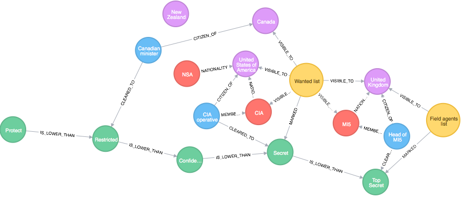
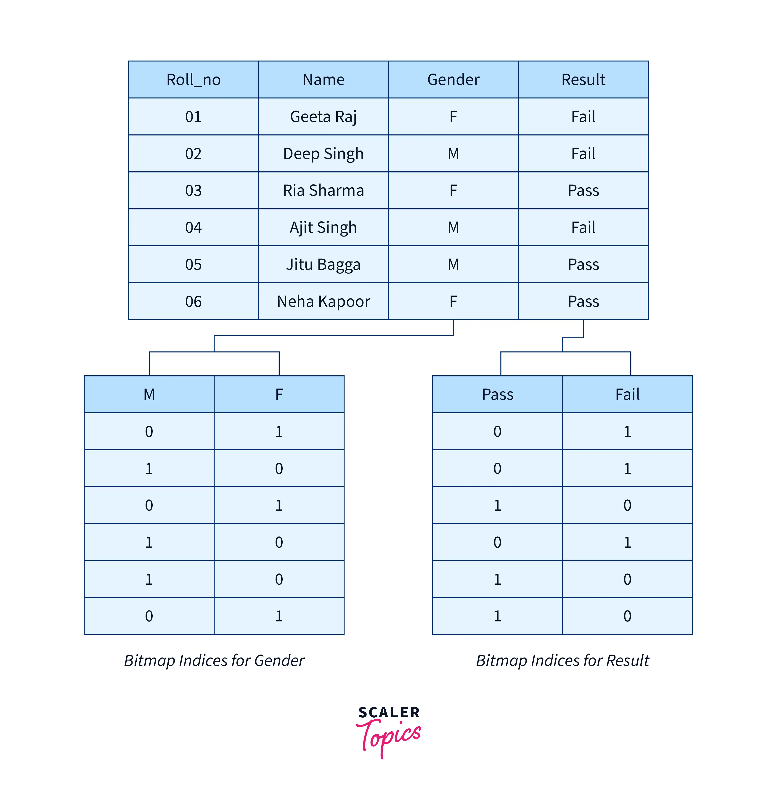
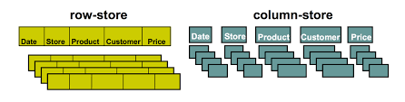

## Topic: Nonrelationsal Database(NoSQL)

NoSQL databases are non-tabular databases and store data differently than relational tables. NoSQL databases come in a variety of types based on their data model. The main types are document, key-value, wide-column, and graph. They provide flexible schemas and scale easily with large amounts of data and high user loads.

In this article, you'll learn what a NoSQL database is and different types of NoSQL Database.

## What is NoSQL Database?

When people use the term “NoSQL database”, they typically use it to refer to any non-relational database. Some say the term “NoSQL” stands for “non SQL” while others say it stands for “not only SQL”. Either way, most agree that NoSQL databases are databases that store data in a format other than relational tables.

## Types of NoSQL Database

- ### Document based Databases

    The datas in are stored in documents similar to JSON (JavaScript Object Notation) objects. Each document contains pairs of fields and values. The values can typically be a strings, numbers, booleans, arrays, or objects.

    Below is a JSON document that stores information about a user named Wangchuk.

    ```
    {
        "_id": 111111,
        "first_name": "Wangchuk",
        "email": "nams@example.com",
        "cell": "012-8349-389",
        "likes": [
            "fashion",
            "hiking",
            "shopping"
        ]   
    }
    ```

- ### Key-Value based Databases

    Key value databases, also known as key value stores, are database types where data is stored in a “key-value” format and optimized for reading and writing that data.

    Below is a key-value pair representation of a user named Yeshey, including nested key-value pairs for social media profiles.

    ```
    {
    name: "Yeshey",
      age : 20,
      dob : "02-10-2004",
      profile_pic : "https://profile.com/yeshey.jpg",
      social : {
             twitter : "@genjiYeShEy",
                 linkedin : "https://linkedin.com/singye"
               }
    }
    ```

- ### Graph Database

    A graph database is defined as a specialized, single-purpose platform for creating and manipulating graphs. Graphs contain nodes, edges, and properties, all of which are used to represent and store data in a way that relational databases aren't equipped to do.

    

- ### Vector Databases

    A vector database is a collection of data stored as mathematical representations. Vector databases make it easier for machine learning models to remember previous inputs, allowing machine learning to recommend, and text generation use-cases.

- ### Time-series Databases

    Relational and non-relational databases have timestamp data types to store time-related data. Time series databases are specifically designed for time series data management.

    Time series data can be measured in seconds and minutes (like sensor-based devices), hourly (like phone usage), daily (petrol price), weekly (timesheets), monthly (electricity consumption), quarterly (performance reports), half-yearly (company growth), or annually (profits and revenue).
    
     

- ### Column oriented Databases

    Column-oriented databases are organized as a set of columns. When you want to run analytics on a small number of columns in the network, you can read those columns directly without consuming memory with unwanted data. A column-oriented database can aggregate the value of a given column (for example, adding up sales for the year).

    


## Advantages, Disadvantages and Applications of NoSQL

|  | Advantages | Disadvantages  | Applications  |
| ----------- | ----------- | ----------- | ----------- |
| Document stores | Simple & Powerful Data model, Scalable and No foreign Keys | Not Suitable for Relational Data, Querying Limited to Keys & Indexes, Map Reduce Required for More Significant Queries| E-commerce Platforms, Mobile App Backends, and Real-Time Analytics|
| Key-Value | Simplicity, Scalability and speed | No Relationships, Must Create Their Own Foreign Keys, Not Suitable for Complex Data, Lacks Scanning Capabilities| Web Applications and Real-Time Recommendations and Advertising|
| Column Oriented | Supports semi-structured data, Naturally indexed and Scalable | Not suitable for relational data |Machine Learning and AI Workloads, Big Data Analytics |
| Graph  | Extremely Powerful, Connected Data is Locally Indexed, Can Provide ACID | Difficult to Scale Out, Though Can Scale Up | Fraud Detection, Network and IT Operations, Master Data Management |
| Vector | Efficient in Similarity Searches, Good at Handling High-Dimensional Data, Scalability, and Real-Time Analytics | Data Type Limitations, Limited Only for Simple Similarity Searches | Image and Facial Recognition, Natural Language Processing (NLP)|
| Time-Series | Efficient in Storage and Querying, Good for Analytics and Management Related to Time-Series, Free to Use | Complex to Set Up, Requires More Space to Accommodate Large Data, Less Flexibility | Weather Forecasting, Annual Income, and Temperature Detection
|
