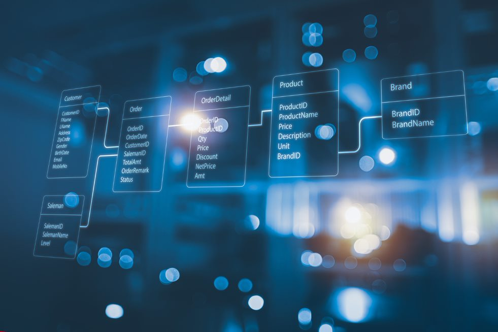
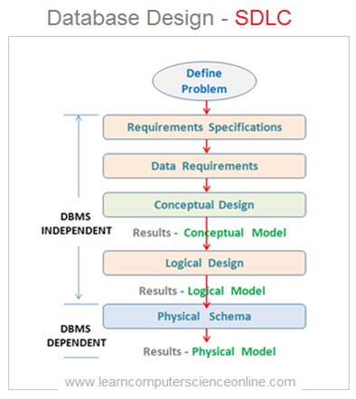
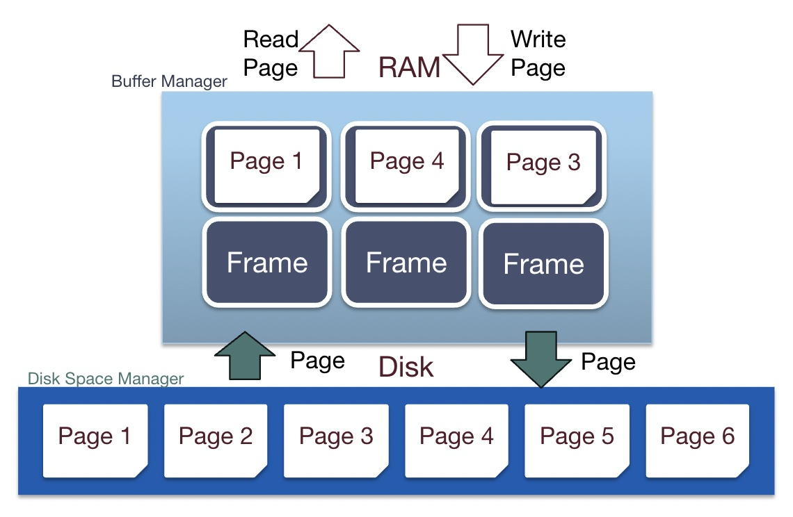

## Topic: Creating a database from scratch

A database is an organized collection of structured data that is stored and can be accessed. It is made so that large amounts of data can be retrieved,inserted, or deleted.

### Main components of database

The main components of a database are:
- **Tables**: A table is a collection of related data organized into rows and columns.Tables are used to store data in a relational database.
- **Fields**: Fields are the individual pieces of data within a table. Each field contains a specific data type, such as a text string, numeric value, or date.
- **Records**: Records are individual rows in a table that contain related data. Each record corresponds to a single item or instance of data, such as a specific customer,
product, or transaction.
- **Primary Key**: The primary Key is a key that helps in uniquely identifying the tuple of the database. In other words, it tells the database, “hey, here I am!”
- **Foreign Key**: Foreign Key is a key that is used to identify the relationship between the tables through the primary key of one table, that is, the primary key of one table
acts as a foreign key to another table.
- **Queries**: A query is a request for data from a database. Queries are used to search and retrieve specific data from a database.
- **Indexes**: An index is a database structure that helps to speed up query performance by allowing the database to locate specific records quickly.
- **Views**: A view is a virtual table based on a query’s result. Views provide a way to
present a subset of data from a database in a specific format.

### How to create our own database?

- **Determine the purpose and requirements of the database**: What kind of data will
be stored, the relationships between the data, who will use the database, and what
kind of queries will be performed on the data.
- Choose a database management system (DBMS) that fits the requirements. Examples of DBMS include MySQL, PostgreSQL, etc..
- **Create a list of entities and a list of attributes**: Create a visual representation of the
database structure, including tables, columns, data types, and relationships
between tables.
- **Implement the database schema**: Create tables and columns of a chosen DBMS,
and specify constraints such as primary keys and foreign keys.
- **Populate the database with data**: Add data to the tables and verify that it meets the
constraints.
- **Test the database**: Perform queries on the data to ensure that it can be retrieved, deleted, or inserted as required.
- **Maintain the database**: Regularly back up the data, monitor performance, and make updates as needed to ensure that the database continues to meet the needs of its users.

### Some popular DBMS for database development include:
- **MySQL**: a widely used open-source relational database management system.
- **PostgreSQL**: a powerful and open-source object-relational database management system.
- **MongoDB**: a document-oriented NoSQL database management system known for its scalability and ease of use.

### Data Structures for implementing a relational database

1. **B-trees**: The B-tree module is a fundamental data structure used in chidb for storing and retrieving data efficiently.
2. **Database Machine (DBM)**: The DBM is a virtual machine designed to operate on chidb files. It includes a set of instructions (low-level and high-level) for manipulating the database.
3. **SQL Compiler**: The SQL compiler is responsible for translating SQL queries into DBM programs
4. **Hash Tables**: For quick lookups of records based on keys.
5. **API**: The API provides a set of functions for interacting with the chidb system. It includes functions for opening and closing database files, executing SQL statements, and accessing query results.
6. **Linked Lists**: For managing records within a table or for maintaining a list of pages in a B-tree
7. **Shell**: The shell provides a command-line interface for interacting with the chidb system. It allows users to run SQL statements, DBM programs, and provides utilities for parsing SQL and displaying the syntax tree and DBM program.
8. **Arrays**: For storing data in a structured format, such as the values in a table row.

### What is Buffer Management in DBMS?

Buffer management in a DBMS is the process of managing the storage of data in a temporary memory area, known as a buffer pool. Buffer Management acts as a bridge between primary memory (RAM) and secondary storage such as a hard disk. The main goal is to reduce the number of disk accesses by placing frequently accessed data in a buffer pool. It’s like having a well-organized bookshelf at home; You keep your favorite books within arm’s reach all the time instead of searching in boxes in the attic.

#### What is a Buffer Manager?

The buffer manager is a one who manages the buffer pool. It decides which data should be kept in the buffer pool and for how long. When a request for data arrives, the buffer manager first checks whether the data is already in the buffer pool. If it’s there, it’s a ‘hit’, and the data is delivered immediately. If not, a ‘miss’ occurs, and the buffer manager brings the data from the disk into the buffer pool. Additionally, the buffer manager must decide which data to remove when the buffer pool becomes full, a process known as the ‘replacement policy’. Think of it as a librarian who manages a reading area; They ensure that the most requested books are easily available while less popular books are also available.

#### Methods of Buffer Management

There are several methods of buffer management, some are as mentioned below:

- **LRU** (Least Recently Used): Removes the least recently accessed pages from the buffer pool, ensuring that the most frequently accessed data remains in the buffer.

- **MRU** (Most Recently Used): Prioritizes the most recently accessed data, keeping it in the buffer for quicker access, assuming that recently accessed data will be accessed again soon.
    - **FIFO** (First In, First Out): A method under MRU, where the oldest data in the buffer is the first to be removed, similar to a queue where the first item added is the first to be removed.

- **Clock Policy**: A variant of LRU, using a circular buffer and a clock hand to mark pages as recently used. Pages marked with '1' are considered recently used and are less likely to be replaced.

- **LFU** (Least Frequently Accessed): Removes the least frequently accessed pages from the buffer, assuming that data accessed less often is less likely to be needed in the near future.