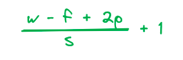
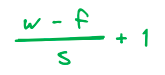

## Topic : Introduction to Convolution Neural Network

A Convolutional Neural Network (CNN) is a type of deep learning neural network that is well-suited for image and video analysis. CNNs use a series of convolution and pooling layers to extract features from images and videos, and then use these features to classify or detect objects or scenes.

### CNN architecture

Convolutional Neural Network consists of multiple layers like the input layer, Convolutional layer, Pooling layer, and fully connected layers. 

1. **Convolutional layer**: This layer is the first layer that is used to extract the various features from the input images. In this layer, We use a filter or Kernel method to extract features from the input image.

2. **Poooling layer**: The primary aim of this layer is to decrease the size of the convolved feature map to reduce computational costs. This is performed by decreasing the connections between layers and independently operating on each feature map. Depending upon the method used, there are several types of Pooling operations. We have Max pooling and average pooling.

3. **Fully-connected layer**: The Fully Connected (FC) layer consists of the weights and biases along with the neurons and is used to connect the neurons between two different layers. These layers are usually placed before the output layer and form the last few layers of a CNN Architecture.

### Advantages of Convolutional Neural Networks (CNNs):
- Good at detecting patterns and features in images, videos, and audio signals.
- Robust to translation, rotation, and scaling invariance.
- End-to-end training, no need for manual feature extraction.
- Can handle large amounts of data and achieve high accuracy.

### Disadvantages of Convolutional Neural Networks (CNNs):
- Computationally expensive to train and require a lot of memory.
- Can be prone to overfitting if not enough data or proper regularization is used.
- Requires large amounts of labeled data.
- Interpretability is limited, it’s hard to understand what the network has learned.