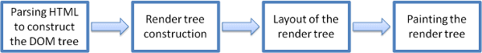
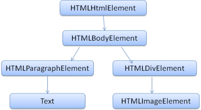

## Unit I: Browsers and Document Object Model

### Browser's main component 

1. **The user interface**: This includes the address bar, back/forward button, etc. Every part of the browser display except the window where you see the requested page.Rendering engines

2. **The browser engine**: It's like a middleman between the UI interface and the rendering engine.

3. **The rendering engine**: Responsible for displaying requested content. For example if the requested content is HTML, the rendering engine parses HTML and CSS, and displays the parsed content on the screen.

4. **Networking**: For network calls such as HTTP requests, using different implementations for different platform behind a platform-independent interface.

5. **UI backend**: Used for drawing basic widgets like combo boxes and windows. This backend exposes a generic interface that is not platform specific. Underneath it uses operating system user interface methods.

6. **JavaScript interpreter**: Used to parse and execute JavaScript code.

7. **Data storage**: This is a persistence layer. The browser may need to save all sorts of data locally, such as cookies. Browsers also support storage mechanisms such as localStorage, IndexedDB, WebSQL and FileSystem.


### Rendering Engines

The responsibility of the rendering engine is that it just displays of the requested contents on the browser screen.

#### The main flow



The rendering engine starts by parsing the HTML document and converting the elements to <span style="color:green">
DOM
</span> nodes in a tree called the "content tree". The engine will parse the style data, both in external CSS files and in style elements. Styling information together with visual instructions in the HTML creates another tree: the <span style="color:green">
render tree</span>.

The render tree contains rectangles with visual attributes like color and dimensions. The rectangles are in the right order to be displayed on the screen.

After the construction of the render tree it goes through a "<span style="color:green">
layout </span>" process. This means giving each node the exact coordinates where it should appear on the screen. The next stage is <span style="color:green">
painting</span> - the render tree will be traversed and each node will be painted using the UI backend layer.


## DOM(Document Object Model)

The output tree (the "parse tree") is a tree of DOM element and attribute nodes. DOM is short for Document Object Model. It is the object presentation of the HTML document and the interface of HTML elements to the outside world like JavaScript.

The root of the tree is the "Document" object.

The DOM has an almost one-to-one relation to the markup. For example:

```
<html>
  <body>
    <p>
      Hello World
    </p>
    <div> </div>
  </body>
</html>
```
This markup would be translated to the following DOM tree:
