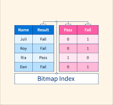
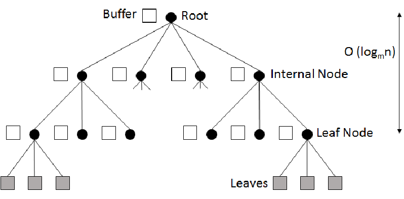

## Topic: Indexing

Hello to all my wonderful readers! I trust you're all doing splendidly. Today, we embark on a fascinating journey into the facinating world of Bitmap Indices, Buffer Trees, and indexing spatial and temporal data. But before we dive in, let's lighten the mood with a little humor, shall we?

Why did the DBA leave her spouse? Because she realized it was a one-to-many relationship! :)

Now, with smiles on our faces, let's explore the complicated parts of databases and figure out the mysteries together.

### Bitmap Indexing in DBMS

It is a technique used in database management systems (DBMS) to improve the performance of read-only queries that involve large datasets with many attributes (columns).

#### Features of Bitmap Indexing in DBMS
1. **Space efficiency**: Bitmap indexes use a compact binary format to store data occurrences, saving space, ideal for large datasets with many attributes.

2. **Fast query processing**: It uses set-based operations like AND, OR, and NOT for speedy processing, reducing the need for full scans.

3. **Flexibility**: Suitable for numerical, categorical, and text data types, including indexing text data with methods like TF-IDF.

4. **Low maintenance overhead**: Bitmap indexes can be updated incrementally, reducing maintenance workload, advantageous for frequently updated data applications.

#### Applications of Bitmap Indexing in DBMS
- Fast queries on large datasets
- Efficient range queries
- Space efficiency
- Multi-dimensional indexing
-Data warehousing applications(https://www.geeksforgeeks.org/data-warehousing/)

**Bitmap indexing** excels in efficiently querying large datasets with numerous attributes, making it a preferred option for data warehousing and applications prioritizing rapid query processing.

### Buffer Tree

A Buffer Tree, also known as a B-Tree, is a data structure commonly used in computer science and database systems to organize and store data in a sorted manner, allowing for efficient search, insertion, and deletion operations.

#### The main features of a Buffer Tree include:

1. **Balanced Structure**: A Buffer Tree maintains a balanced structure, ensuring that the depth of the tree remains relatively constant, which leads to efficient search operations.

2. **Sorted Data**: Data in a Buffer Tree is organized in sorted order, facilitating quick search operations.

3. **Efficient Operations**: Buffer Trees support efficient search, insertion, and deletion operations with time complexities of O(log n), where n is the number of elements in the tree.

**Buffer Trees** are widely used in database systems for indexing and organizing data, as well as in file systems for managing disk storage efficiently.

### Indexing of Spatial and Temporal Data

Indexing spatial and temporal data means creating special data structures that allow you to quickly find and access information that has both location (spatial) and time (temporal) components.

1. **Spatial indexing**:

- It helps in storing and finding data based on its location.

- It let us do spatial queries, like finding all objects in a certain area.

2. **Temporal indexing**:

- It handles time-based data, like timestamps or time ranges.

- It helps us in finding things that happened within a certain time period.

3. **Spatio-temporal indexing**:

- It is the combination of spatial and temporal indexing to handle both location and time together.

- It allows complex queries that involve both location and time constraints.

In summary, **indexing spatial and temporal data** is a way to structure and access information that has both location and time components, enabling many useful applications across different fields.