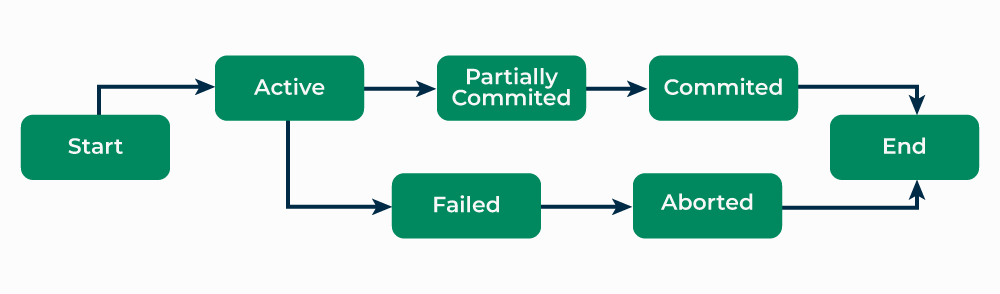

## Transactions

Hey everyone! Today, we're diving into the essential topic of transactions in databases. We'll uncover how transactions keep your data reliable and consistent through their ACID properties. Plus, we'll explore serializability, which ensures that multiple transactions can run concurrently without causing chaos. So, get ready, because we're about to make the complex world of database transactions easy to understand!

### Understanding Transactions in DBMS

In a Database Management System (DBMS), any logical work or set of works done on the data of a database is known as a **transaction**. This can include operations like inserting a new value, deleting existing values, or updating current values in the database.

#### Steps in a Transaction

A typical transaction in a DBMS involves three main steps:

1. **Read Data**
2. **Write Data**
3. **Commit**

#### Example: Money Transfer Between Accounts

Let's understand these steps with an example. Suppose we have two accounts, `account1` and `account2`, each with an initial balance of Nu.1000. We want to transfer Nu.500 from `account1` to `account2`.

1. **Read Data**:

    - All account details are stored in secondary memory. For the transaction, they are brought into primary memory.

2. **Write Data**:

    - Read the data of `account1` and deduct Nu.500. Now, `account1` contains Nu.500.

    - Read the data of `account2` and add Nu.500. Now, `account2` contains Nu.1500.

3. **Commit**:

    - The commit command indicates that the transaction has been successful, and the changes can be stored back in secondary memory.

    - If there is a failure before the commit command, the system will revert to its previous state, and no changes will be saved.

#### Transaction States

During the complete process of a transaction, there are several states. The diagram below illustrates these states:



### ACID Properties in DBMS

In order to maintain consistency in a database, before and after the transaction, certain properties are followed. These are called `ACID` properties.


1. **Atomicity**:

    Atomicity ensures that a transaction is treated as a single, indivisible unit of work. Either all the operations within the transaction are completed successfully, or none of them are. If any part of the transaction fails, the entire transaction is rolled back to its original state, ensuring data consistency and integrity.

2. **Consistency**:

    Consistency ensures that a transaction takes the database from one consistent state to another consistent state. The database is in a consistent state both before and after the transaction is executed. Constraints, such as unique keys and foreign keys, must be maintained to ensure data consistency.

3. **Isolation**:

    Isolation ensures that multiple transactions can execute concurrently without interfering with each other. Each transaction must be isolated from other transactions until it is completed. This isolation prevents dirty reads, non-repeatable reads, and phantom reads.

4. **Durability**: 

    Durability ensures that once a transaction is committed, its changes are permanent and will survive any subsequent system failures. The transaction’s changes are saved to the database permanently, and even if the system crashes, the changes remain intact and can be recovered. 

### Serializability

Serializability ensures that multiple transactions can execute concurrently without interfering with each other, thereby maintaining synchronization. It also checks whether the concurrent execution of two or more transactions preserves database consistency.

#### Schedules in DBMS are of types:

1. **Serial Schedule**: 

    A schedule in which only one transaction is executed at a time that is one transaction is executed completely before starting another transaction.

    | Transaction-1 | Transaction-2 |
    |----------|----------|
    |   R(a)   |    |
    |   W(a)   |    | 
    |   R(b)   |    |
    |   W(b)   |    |
    |          |R(b)|
    |          |W(b)| 
    |          |R(a)|
    |          |W(a)|
    |

    Here we can see that `Transaction-2` starts its execution after the completion of `Transaction-1`.

    #### Example

    Here is an example of a serial schedule in SQL
    ```
    BEGIN;
   UPDATE accounts SET balance = balance - 100 WHERE account_number = 'A123';
   UPDATE accounts SET balance = balance + 100 WHERE account_number = 'B456';
    COMMIT;
    ```

    Here we are doing 2 updates, one is reducing the balance of account `A123` by 100 and other is increasing the balance of account `B456` by 100 in one transaction, this is called as debit-credit transaction where balance of one account is credited and other account is debited.

2. **Non-serial Schedule**: 
    
    A non-serial schedule is a schedule in which transactions are executed concurrently. In other words, a non-serial schedule is a schedule in which transactions are executed in a multi-threaded environment.

    | Transaction-1 | Transaction-2 |
    |----------|----------|
    |   R(a)   |    |
    |   W(a)   |    | 
    |      | R(b)   |
    |     |   W(b)  |
    |   R(b)       ||
    |          |R(a)|
    |W(b)||
    |          |W(a)|
    |


    Here we see that `Transaction-2` begins its execution before `Transaction-1` is finished, and they are both working on the same data, i.e., “a” and “b”, interchangeably. Where “R”-Read, “W”-Write.

    #### Example

    Here is an example of a non-serial schedule in SQL

    ```
    BEGIN TRANSACTION;
   UPDATE accounts SET balance = balance - 100 WHERE account_number = 'A123';
    COMMIT TRANSACTION;
    BEGIN TRANSACTION;
    UPDATE accounts SET balance = balance + 100 WHERE account_number = 'B456';
    COMMIT TRANSACTION;
    ```
 
    Here we are doing 2 updates in two different transactions, one is reducing the balance of account `A123` by 100 and other is increasing the balance of account `1B456` by 100.


#### What is serializable schedule?

If a non-serial schedule and a serial schedule result in the same then the non-serial schedule is called a serializable schedule.

#### What is conflicting pair in transaction?

Two operations inside a schedule are called conflicting if they meet these three conditions:

- They belong to two different transactions.
- They are working on the same data piece.
- One of them is performing the WRITE operation.

To conclude, let’s take two operations on data: "a". The conflicting pairs are:

- READ(a) - WRITE(a)
- WRITE(a) - WRITE(a)
- WRITE(a) - READ(a)

#### Types of Serializability

There are two types of serializability in DBMS that are `conflict serializability` and `view serializability`. 

`Conflict serializability` ensures that the result of any execution of the transactions is the same as the result of executing them in some serial order.

`View serializability` ensures that any view of the database that can be obtained by executing the transactions in some serial order is the same as the view that can be obtained by executing them concurrently.

#### Testing of Serializability in DBMS with Examples

Testing serializability in DBMS is important for maintaining the accuracy and stability of multiple simultaneous transactions. There are two primary methods for testing serializability: the  `precedence graph method` and the `conflict serializability method`. Let's explore how to test serializability in DBMS using these methods.

1. **Precedence Graph Method**

    **Example**

    Consider a schedule with three transactions, T1, T2, and T3, with the following set of operations:

    - T1: R(A), W(B)
    - T2: W(A), R(B)
    - T3: R(B), W(A)

    **Steps**

    **Step 1: Create a Precedence Graph**

    Draw edges from one transaction to another to represent dependencies due to conflicting operations.

    - T1 -> T2
    - T2 -> T3
    - T3 -> T1

    **Step 2: Check for Cycles**

    If the precedence graph contains a cycle, the schedule is not serializable.

    - In this example, T1 -> T2 -> T3 -> T1 forms a cycle.

    Since there is a cycle, the schedule is not serializable.

2. **Conflict Serializability Method**

    This method checks for conflicts between read and write operations.

    **Example**

    Consider the same transactions:

    - T1: R(A), W(B)
    - T2: W(A), R(B)
    - T3: R(B), W(A)

    **Steps**

    **Step 1: Identify Conflicting Operations**

    Identify pairs of conflicting operations:

    - T1 and T2 conflict on (R(A), W(A))
    - T2 and T3 conflict on (R(B), W(A))

    **Step 2: Check for Conflicts**

    If there are conflicts, the schedule is not serializable. If there are no conflicts, the schedule is serializable.

    - In this case, there are conflicts between T1 and T2, and T2 and T3.

    Since there are conflicts, the schedule is not serializable.

### Conclusion

Transactions in DBMS ensure reliable and consistent database operations through their ACID properties: **Atomicity, Consistency, Isolation,** and **Durability**. Serializability ensures that concurrent transactions do not interfere with each other and maintain database consistency, allowing for correct execution as if transactions were performed serially. These principles are vital for maintaining data integrity and stability in database systems.

<p style="text-align: center;">THANK YOU:)</p>