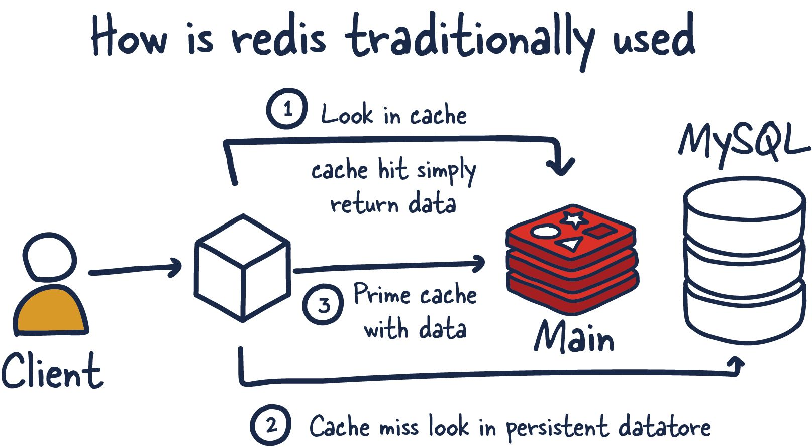
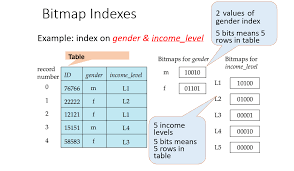

## Topic: Query Optimization and Materialized Views

### Introduction

Hey everyone! Today, we're going to talk about making your database work smarter, not harder. We'll explore how to make your queries run faster and smoother through something called query optimization. Plus, we're also going to learn about materialized views and how they can help boost our database's performance. So, buckle up, because we're about to make some database magic easy to understand!

### Advanced Query Optimization

Query optimization is the process of enhancing the performance of a database query to ensure it runs as efficiently and quickly as possible.

**Query Explainers**

Query explanation tools, such as the EXPLAIN command in PostgreSQL, help understand how the database executes a query. This allows the identification of performance bottlenecks and the optimization of the execution plan.

```
// Example of using EXPLAIN in SQL
EXPLAIN SELECT * FROM products WHERE price > 100;
```

**Batch Queries**

Processing multiple operations in a single batch can reduce system overhead by minimizing the number of database connections and queries.

```
// Example of using batch queries in Node.js
const batchQuery = async () => {
  const queries = [
    'UPDATE products SET stock = stock - 1 WHERE id = 1;',
    'INSERT INTO records (product_id, action) VALUES (1, "Sale");',
  ];

for (const query of queries) {
    await db.query(query);
  }
};
```
**In-Memory Storage**

Using in-memory databases like Redis for queries that require low latency can significantly speed up read operations.



```
// Example of using Redis in Node.js
const redis = require('redis');
const client = redis.createClient();

client.set('key', 'value');
client.get('key', (err, reply) => {
  console.log(reply); // Output: 'value'
});
```
**Bitmap Index Usage**

Bitmap indexes are an advanced technique particularly useful in scenarios with low cardinality, where field values have a limited number of different occurrences. Instead of creating traditional indexes, bitmap indexes record which records contain specific values in fields. This is useful for queries involving filters on categorical fields, such as “status” or “type.”



```
// Example of creating a bitmap index in PostgreSQL
CREATE INDEX idx_status ON orders USING bitmap(status);
```
**Table Partitioning**

Table partitioning is an advanced technique that divides a large table into smaller partitions based on specific criteria, such as a range of values in a column. This can significantly improve query performance, especially when dealing with large volumes of data.

```
// Example of partitioning in PostgreSQL
CREATE TABLE logs (
  id serial PRIMARY KEY,
  date timestamp,
  ...
) PARTITION BY RANGE (date);

CREATE TABLE logs_january PARTITION OF logs
  FOR VALUES FROM ('2023-01-01') TO ('2023-01-31');
  ```

### Materialized Views

A materialized view is a view whose contents are computed and
stored.

Consider the view
```
create view department_total_salary(dept_name, total_salary) as
select dept_name, sum(salary)
from instructor
group by dept_name
```
Materializing the above view would be very useful if the total salary by
department is required frequently. It saves the effort of finding multiple tuples and adding up their
amounts

### Conclusion

To wrap things up, optimizing your queries and using materialized views can make your database work much faster and more efficiently. Here’s a quick recap of what we learned:

- **Query Optimization**: This helps your queries run quickly by making them as efficient as possible. Using tools like query explainers, batch queries, in-memory storage (like Redis), bitmap indexes, and table partitioning can significantly speed up your database operations.

- **Materialized Views**: These are saved results of a query that you can use again and again without having to run the query from scratch each time. This is especially helpful for complex calculations that you need frequently.

By applying these techniques, you can greatly improve your database's performance. This means quicker access to your data, less strain on your system, and a better experience for users. So, use these tips to make your database smarter and faster!

### What we did during our flipped class

Today's flipped class was exceptionally engaging and efficient. We were divided into four groups of six members each, chosen randomly. Beforehand, we were provided with resources to get a basic understanding of the topics. During the class, we first discussed our assigned topics within our home groups. Groups 1 and 3 focused on materialized views, while Groups 2 and 4 tackled query optimization.

My group discussed materialized views for 10 minutes, after which we were tasked with creating five quiz questions related to our topic. To accomplish this, Groups 1 and 4 collaborated, as did Groups 2 and 3, resulting in a total of 10 questions from each pairing.

Once the questions were prepared, we had a lively Q&A session, where each team posed their questions to the other. Team 1 emerged victorious, scoring the highest. This interactive element made the flipped class particularly interesting, as it provided great opportunity to share our thoughts, debate specific questions, and deepen our understanding of the topics through discussion. 

And I hope that our tutor continues to use this kind of approach in future classes.

<p style="text-align: center;">THANK YOU:)</p>
