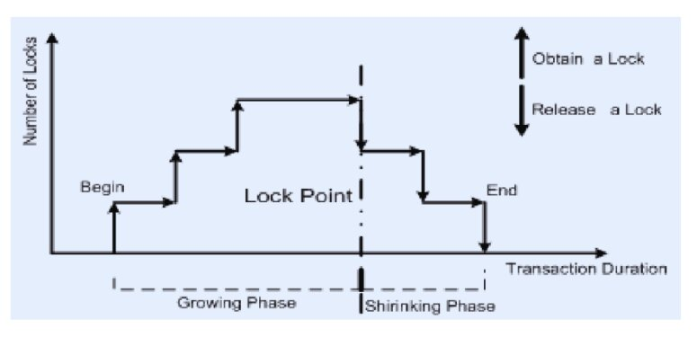

## Concurrency Control

Warm Greetings to all the readers!

In this article, we are going to explore what a concurrency control system is, some of the key techniques involved, and finally, delve into the key differences between locks and latches.

### Understanding Concurrency Control in DBMS

Concurrency Control is a fundamental aspect of a **Database Management System (DBMS)**, designed to manage simultaneous operations without conflicts. Its main goal is to maintain consistency, integrity, and isolation when multiple users or applications access the database at the same time.

In environments where multiple users interact with a database simultaneously, concurrent execution is commonplace. Imagine a busy library with several librarians updating book records at once. Just as multiple librarians shouldn’t modify the same record simultaneously, database users must avoid interfering with each other’s operations.

Concurrent execution offers benefits such as better system resource utilization and increased throughput. However, it also brings challenges. Ensuring that these simultaneous transactions do not conflict is essential to maintaining a consistent and correct database state. For example, if two users try to book the last seat on a flight at the same moment, the system must ensure only one succeeds.

#### Challenges of Concurrent Execution

Concurrent execution can lead to several issues:

1. **Lost Updates**: If two users attempt to update the same data item simultaneously, one user’s changes might be overwritten by the other’s if they are unaware of each other’s actions.

2. **Uncommitted Data**: If one user reads data that another user has updated but not yet committed (finalized), and the second user later aborts (cancels) their transaction, the first user ends up with invalid data.

3. **Inconsistent Retrievals**: When a transaction reads multiple values from the database while another transaction modifies some of those values mid-operation, it can lead to inconsistent results.

**To address these challenges, the DBMS employs concurrency control techniques**. Think of it like traffic rules. Just as traffic rules ensure vehicles don’t collide, concurrency control ensures transactions don’t conflict.

#### Why is Concurrency Control Essential?

1. **Ensure Database Consistency**: Without concurrency control, simultaneous transactions can interfere with each other, causing inconsistent database states. Proper concurrency control ensures consistency even with numerous concurrent transactions.

2. **Avoid Conflicting Updates**: Concurrency control prevents scenarios where one transaction’s update overwrites another’s, thus avoiding unintended data loss.

3. **Prevent Dirty Reads**: By controlling concurrency, the system ensures that one transaction doesn’t read data in the middle of another transaction’s update process, preventing “dirty” reads where data reflects an unfinalized state.

4. **Enhance System Efficiency**: Concurrency control allows multiple transactions to be processed in parallel, improving system throughput and optimizing resource use.

5. **Protect Transaction Atomicity**: Ensuring that all operations within a transaction either succeed (commit) or fail (abort) is crucial. Concurrency control maintains this atomicity, treating each transaction as an indivisible unit, even when executed concurrently with others.

### Concurrency Control Techniques in DBMS

Concurrency control in a Database Management System (DBMS) is vital for maintaining consistency and integrity when multiple transactions occur simultaneously. Among the various techniques used for concurrency control, two prominent ones are the `Two-Phase Locking (2PL) Protocol` and the `Timestamp Ordering Protocol`. Let's delve into each in detail.

1. **Two-Phase Locking Protocol**

Two-Phase Locking (2PL) is a concurrency control method that ensures transactions are executed in a manner that maintains database consistency. It operates in two distinct phases: the `Growing Phase` and the `Shrinking Phase`.

**Breakdown of the Two-Phase Locking Protocol**:

1. **Phases**:

    - **Growing Phase**: During this phase, a transaction can acquire any number of locks as needed but cannot release any locks. This phase continues until the transaction has obtained all the locks it requires and stops requesting new ones.

    - **Shrinking Phase**: Once the transaction releases its first lock, it enters the Shrinking Phase. In this phase, the transaction can release locks but cannot acquire any new locks.

2. **Lock Point**: The exact moment when the transaction transitions from the Growing Phase to the Shrinking Phase (i.e., when it releases its first lock) is known as the lock point.

The primary objective of the Two-Phase Locking Protocol is to ensure conflict-serializability. By structuring transactions into these two phases, 2PL ensures that transactions do not interfere with each other in ways that could produce inconsistent results.

2. **Timestamp Ordering Protocol**

The Timestamp Ordering Protocol is another concurrency control method that maintains the serializability of transactions by using timestamps to order them. Instead of locks, it uses timestamps to manage transaction order and concurrency.

**Breakdown of the Timestamp Ordering Protocol**:

1. **Read Timestamp (RTS)**:

    - This is the most recent timestamp of a transaction that has read the data item.

    - Whenever a transaction with timestamp TS reads a data item X, the RTS of X is updated to TS if TS is more recent than the current RTS of X.

2. **Write Timestamp (WTS)**:

    - This is the most recent timestamp of a transaction that has written to the data item.

    - Whenever a transaction with timestamp TS writes to a data item X, the WTS of X is updated to TS if TS is more recent than the current WTS of X.

The protocol uses these timestamps to decide whether a transaction's request to read or write a data item should be allowed. By ensuring that operations follow a consistent order based on their timestamps, the protocol prevents the formation of cycles, thus avoiding deadlocks.

### What Are Locks?

Locks are synchronization mechanisms used in concurrency control within a Database Management System (DBMS). They manage access to shared data items, ensuring data consistency during concurrent transactions.

Locks allow transactions to acquire read or write access to data, preventing conflicts and enforcing isolation. They come in different types, each serving a specific purpose:

- **Shared Locks (S-Locks)**: Allow multiple transactions to read a data item concurrently but prevent any transaction from writing to it.

- **Exclusive Locks (X-Locks)**: Allow a transaction to both read and write a data item while preventing other transactions from accessing it in any form.

Locks are essential for maintaining database integrity by ensuring that transactions do not interfere with each other.

### What Are Latches?

Latches are synchronization mechanisms used to control concurrent access and ensure data consistency in a DBMS. They are commonly employed to protect shared resources, such as data structures or buffers, from concurrent access by multiple transactions or threads.

Latches are designed for rapid acquisition and release, often within a single CPU cycle, making them highly effective for protecting frequently accessed data structures. They operate in two modes:

- **Shared Latches**: Permit concurrent read access by multiple transactions or threads, allowing them to read a data structure without interference.

**Exclusive Latches**: Provide exclusive write access, preventing simultaneous modifications by other transactions or threads.

Latches are crucial for ensuring that data structures within a DBMS remain consistent and are not corrupted by concurrent operations.

### Differences Between Locks and Latches

| Characteristic | Locks	 | Latches |
|----------|----------|----------|
|  Granularity    | Operate at a higher level of granularity, acquired on shared resources such as tables, rows, or pages.  |Acquisition occurs at a lower-level data structure as buffers and data pages.  |
| Usage    | 	Used for concurrency control in a multi-user database system.   | Used for synchronization within a single-thread environment. |
| Lock Modes | Support various modes such as shared (read) locks and exclusive (write) locks. | Typically binary in nature and only allow (write) access. |
| Duration  | Typically held for a longer duration.	  | For shorter durations.|
| Complexity	 | More complex and involve additional bookkeeping.	 | Latch acquisition and release operations are lightweight and efficient.|
|

### Conclusion

In the article, we have seen that a concurrency control system is a critical component of a DBMS, ensuring the proper management of concurrent transactions. The key techniques employed include locking, timestamping, and optimistic concurrency control.

We have also explored the distinction between locks and latches. Locks are used to maintain data consistency and isolation between transactions, while latches protect the internal data structures of the DBMS from being accessed by multiple threads simultaneously.

THANK YOU:)
