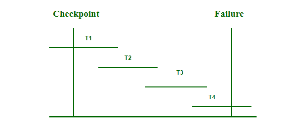

## Recovery System

Database recovery techniques are essential for maintaining the integrity, consistency, and availability of data within database management systems (DBMS). These techniques restore a database to a consistent state after failures or errors, preventing data loss and ensuring continued reliability. In this article, we will discuss two prominent recovery techniques: ARIES and Fuzzy Checkpoints.

### ARIIES (Algorithm for Recovery and Isolation Exploiting Semantics)

ARIES (Algorithm for Recovery and Isolation Exploiting Semantics) is a robust and efficient recovery algorithm used in database management systems. Its primary goal is to ensure that databases can recover to a consistent state after a crash or failure, preserving the atomicity and durability properties of transactions.

#### Key Concepts

- **Write-Ahead Logging (WAL)**

    - ARIES is based on the Write-Ahead Log protocol. WAL ensures that all changes (updates, inserts, deletes) to the database are logged before they are applied to the database itself. This allows the system to recover from crashes by replaying or undoing these logged changes.

- **Logs**

    - Logs are essential in ARIES. They keep a record of all database operations. When a crash occurs, these logs are used to restore the database to a consistent state.

#### ARIES Algorithm Phases

1. **Analysis Phase**

    - The analysis phase scans the log from the last checkpoint to the end.

    - It identifies all active transactions at the time of the crash and reconstructs the Dirty Page Table (DPT), which tracks pages that were modified but not yet written to disk.

    - This phase helps in determining which transactions were incomplete and need to be undone.

2. **Redo Phase**

    - Once the analysis phase is complete, the redo phase starts.

    - In this phase, the log is read forward from the last checkpoint, and all the operations recorded in the log are reapplied to the database. 

    - This ensures that all changes made by committed transactions are reflected in the database. Only changes that are not already present in the database (as indicated by the DPT) are redone.

3. **Undo Phase**

    - After the redo phase, the undo phase begins. 

    - The log is scanned backward, and the operations of transactions that were active at the time of the crash are undone in reverse order.

    - This ensures that any changes made by uncommitted transactions are rolled back, leaving the database in a consistent state. 

    - Compensation Log Records (CLRs) are written during this phase to log the undo operations, ensuring that they can be redone if another crash occurs during the undo process.

#### Advantages of ARIES

- **Simplicity and Flexibility**: ARIES is straightforward and can be adapted to various database and storage systems.

- **Concurrency Control**: Supports concurrent transaction processing, making it suitable for high-performance environments.

- **Independent Recovery**: Allows for the independent recovery of every page in the database, speeding up the recovery process and improving system availability.

### Fuzzy Checkpoint

A fuzzy checkpoint is a mechanism in a Database Management System (DBMS) that allows ongoing transactions to continue while dirty pages (modified pages in memory that have not yet been written to disk) are being flushed to disk. This approach aims to improve system performance and transaction throughput by reducing the time and resource overhead associated with checkpoint operations.

#### Key Characteristics

1. **Non-blocking Checkpointing**

    - Unlike a full checkpoint, which may require a halt in transaction processing to ensure consistency, a fuzzy checkpoint permits active transactions to run concurrently with the checkpoint process.

2. **Checkpoint Boundaries**

    - New log records are used to demarcate the boundaries of a checkpoint:
        - **CHECKPOINT-BEGIN**: Marks the start of the checkpoint process.
        - **CHECKPOINT-END**: Includes the Active Transaction Table (ATT) and the Dirty Page Table (DPT), providing a snapshot of the transactions that were active and the pages that were dirty at the time of the checkpoint.

3. **Log Sequence Numbers (LSN)**

    - The LSN of the CHECKPOINT-BEGIN record is written to the database's MasterRecord on disk once the checkpoint successfully completes. This LSN serves as a reference point for recovery operations.

5. **Exclusion of New Transactions**

    - Transactions that start after the checkpoint begins are excluded from the ATT in the CHECKPOINT-END record, ensuring that only transactions active at the start are considered for recovery.

### Database Logging

Database logging is a crucial component in the design of a highly available database solution. Logs are essential for recovering from failures and synchronizing primary and secondary databases. They keep a record of all changes made to the database, making it possible to restore the database to a consistent state at any point in time, beyond the last full offline backup.

#### Types of Database Logging

1. **Circular Logging**

    - **Description**: Circular logging is the default logging behavior when a new database is created. In this mode, the log files are reused in a circular manner.

    - **Configuration**: The **logarchmeth1** and **logarchmeth2** database configuration parameters are set to OFF.

    - **Recovery Capability**: This type of logging allows recovery only up to the point of the last backup. Changes made after the last backup are lost if the database fails.

    - **Use Case**: Suitable for environments where data changes are not critical or where frequent backups are taken.

2. **Archive Logging**

    - **Description**: Archive logging is designed for rollforward recovery. In this mode, log files are copied from the current log path or mirror log path to a different location, ensuring they are not overwritten.

    **Recovery Capability**: Allows for rollforward recovery using both archived logs and active logs. This enables the database to be restored to the end of the logs or to a specific point in time, capturing all changes made after the backup.

    - **Use Case**: Ideal for mission-critical environments where it is essential to recover the database to the latest possible state.

### Conclusion

Database recovery techniques such as ARIES and Fuzzy Checkpoints are crucial for ensuring the reliability and integrity of DBMS. ARIES provides a robust framework for complete and structured recovery, while Fuzzy Checkpoints offer performance optimization by reducing the impact of checkpointing. Both techniques play vital roles in maintaining data consistency and preventing data loss, ensuring that databases can recover effectively from failures.